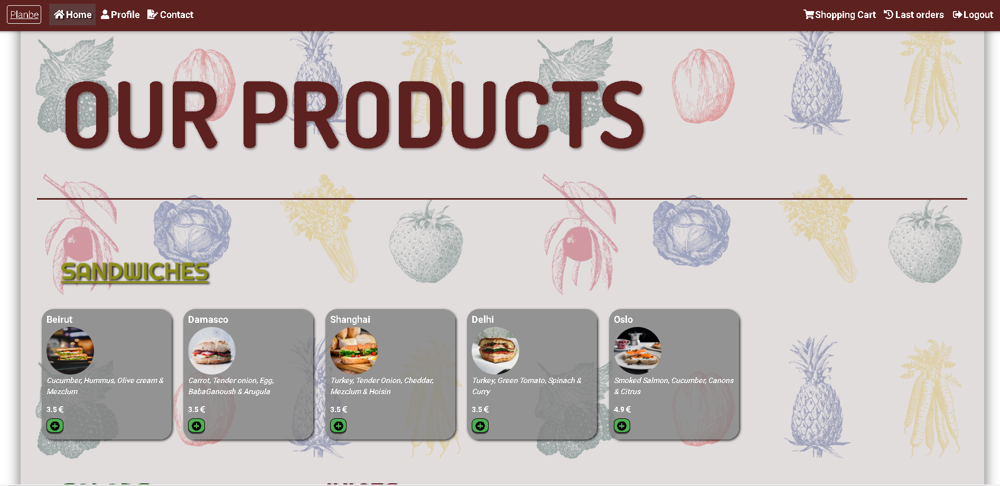
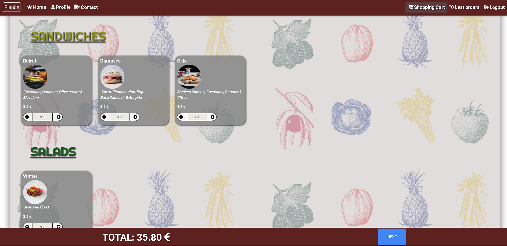

# planbe

planbe is a responsive app for an actual company a friend is running up now which cooks sells and delivers breakfasts to the users

Web application that lets the user choose among the products the company offers, inform about the dropping place and time and pay it, and finally see the orders.

It has been developed during 2 weeks for the presentation of the final project of the bootcamp in [Skylab Coders](https://skylabcoders.com/).

View the [documentation](./doc/README.md)

## Screenshoots
**Landing page:**


**Home page:**


**Cart page:**


## Instructions

### Running the application

__Server__

```
$ cd back
$ npm i
$ npm run build
$ npm start
```

__Frontend__

```
$ cd front 
$ npm i
$ npm run build
$ npm start
```

### Running the tests

__Server__

```
$ cd back
$ mocha logic/index.spec.js
```

__Frontend__

```
$ cd front 
$ mocha src/logic.spec.js
```

## Authors

- Pep del Baño [https://github.com/pepdbm7](https://github.com/pepdbm7)